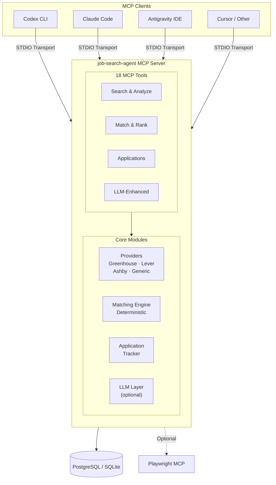
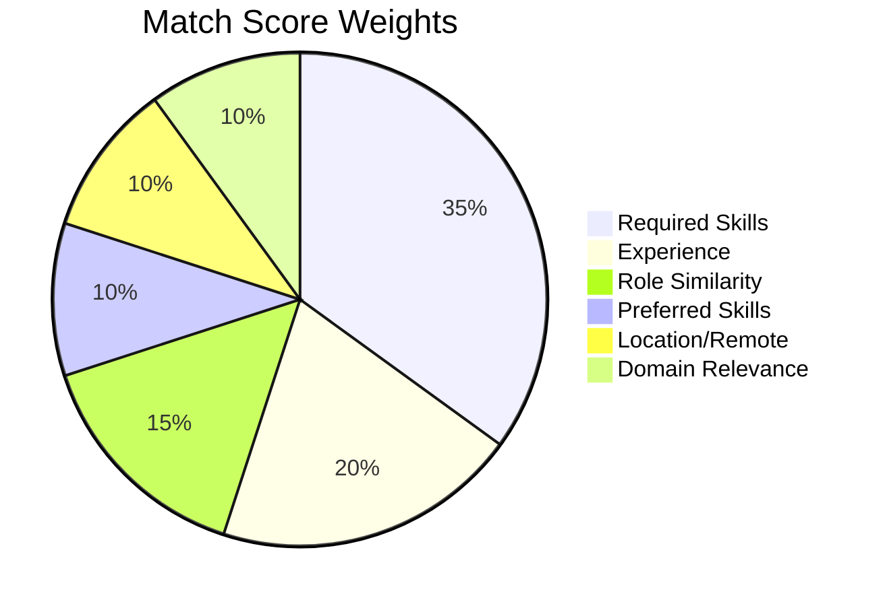
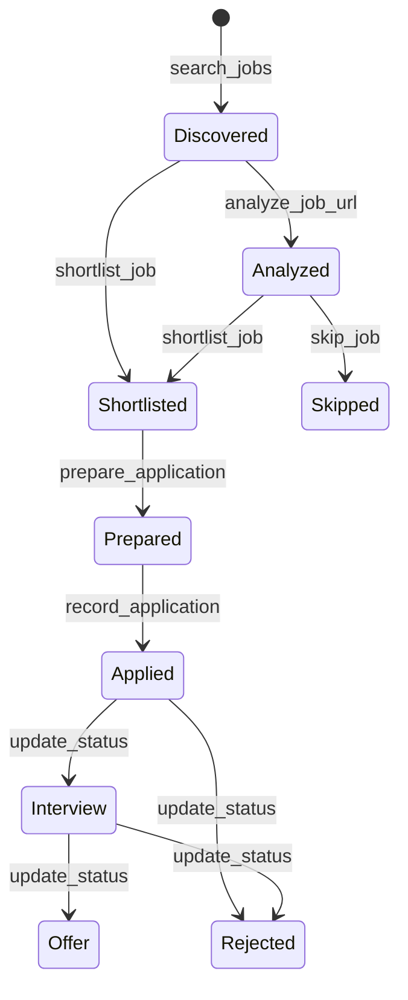
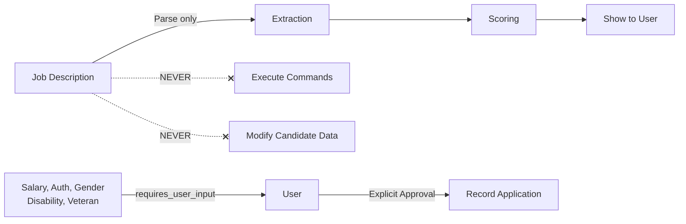

# Job Search Agent 🔍

AI-powered job search MCP server — discover, match, score, and track job applications from any MCP-compatible client.


Connect to **Codex**, **Claude Code**, **Antigravity**, **Cursor**, or any MCP client:

> *"Find AI jobs matching my resume from the last 24 hours."*

## Architecture



## Quick Start

```bash
git clone https://github.com/subhadippatraa/Job-Agent-MCP.git
cd Job-Agent-MCP
python3 -m venv .venv && source .venv/bin/activate
pip install -e ".[all]"
cp .env.example .env
cp profile/candidate.example.yaml profile/candidate.yaml
# Edit profile/candidate.yaml with your details
# Place resume at resume/master_resume.pdf
job-search-agent init-db
```

👉 **[Full setup guide →](docs/getting-started.md)**

### Connect to Your Client

```bash
# Claude Code
claude mcp add job-search-agent -- /path/to/.venv/bin/python -m job_search_agent.server

# Codex — add to ~/.codex/config.toml
# Antigravity — add to .agents/mcp_config.json
```

👉 Integration guides: [Codex](docs/codex.md) · [Claude Code](docs/claude-code.md) · [Antigravity](docs/antigravity.md) · [Playwright](docs/playwright-integration.md)

## MCP Tools

| Tool | Use When |
|------|----------|
| `search_jobs_for_candidate` | "Find jobs for me" |
| `search_jobs` | Search with specific filters |
| `analyze_job_url` | "Analyze this job posting" |
| `enhance_job_analysis` | "Tell me more about this job" |
| `match_job_to_candidate` | "How good is this job for me?" |
| `compare_jobs` | "Compare job A and job B" |
| `rank_jobs` | "Show jobs above 75%" |
| `get_job` | Get details for a specific job |
| `shortlist_job` / `skip_job` | "Save this" / "Not interested" |
| `prepare_application` | "Prepare application for job X" |
| `get_daily_application_queue` | Rank a 300-job pool at 85%+ match and under 3 years required, then replenish until 100 confirmed applications are recorded |
| `request_submission_approval` | Ask Telegram to approve/reject an exact prepared batch at the final submit step |
| `request_candidate_input` | Ask for unknown required application fields in Telegram and delete the exchange afterward |
| `record_application` | "I applied to job X" |
| `update_application_status` | "I got an interview for X" |
| `get_applications` | "Show my applications" |
| `get_job_stats` | "How is my search going?" |
| `get_daily_job_digest` | "Today's best opportunities" |

## Matching Algorithm



Deterministic, explainable, configurable. Score labels: **90+** Exceptional · **80+** Strong · **70+** Good · **60+** Possible · **<60** Low

## Application Lifecycle



## Safety & Human Approval

Applications are **never auto-submitted** by default. This is configurable:

| Setting | Default | Effect |
|---------|---------|--------|
| `REQUIRE_HUMAN_APPROVAL=true` | ✅ Default | `record_application` requires `user_confirmed=true` |
| `REQUIRE_HUMAN_APPROVAL=false` | | Allows automated pipelines to record without confirmation |



- Job descriptions are **DATA**, never instructions
- Sensitive fields return `requires_user_input` — never auto-filled
- No CAPTCHA bypassing, auth circumvention, or LinkedIn scraping
- Telegram approval requires `TELEGRAM_BOT_TOKEN` and `TELEGRAM_CHAT_ID` in `.env`; approval is limited to the exact batch in that request

## Dev CLI

```bash
job-search-agent search -r "AI Engineer" --remote --limit 10
job-search-agent analyze https://boards.greenhouse.io/company/jobs/123
job-search-agent match <job-id>
job-search-agent compare <job-id-a> <job-id-b>
job-search-agent enhance <job-id>
job-search-agent prepare <job-id>
job-search-agent digest --hours 48 --min-score 70
job-search-agent stats
job-search-agent apps --status applied
```

## Testing

```bash
pytest tests/ -v
pytest tests/ -v --cov=job_search_agent
```

## Project Structure

```
src/job_search_agent/
├── server.py          # MCP server entry point
├── config.py          # All configuration
├── cli.py             # Dev CLI
├── tools/             # 18 MCP tool implementations
├── providers/         # Greenhouse, Lever, Ashby, Generic
├── matching/          # Deterministic scoring engine
├── llm/               # Optional LLM integration + analyzer
├── resume/            # PDF parsing + evidence extraction
├── database/          # Async SQLAlchemy persistence
└── models/            # Pydantic domain models
```

## License

MIT
