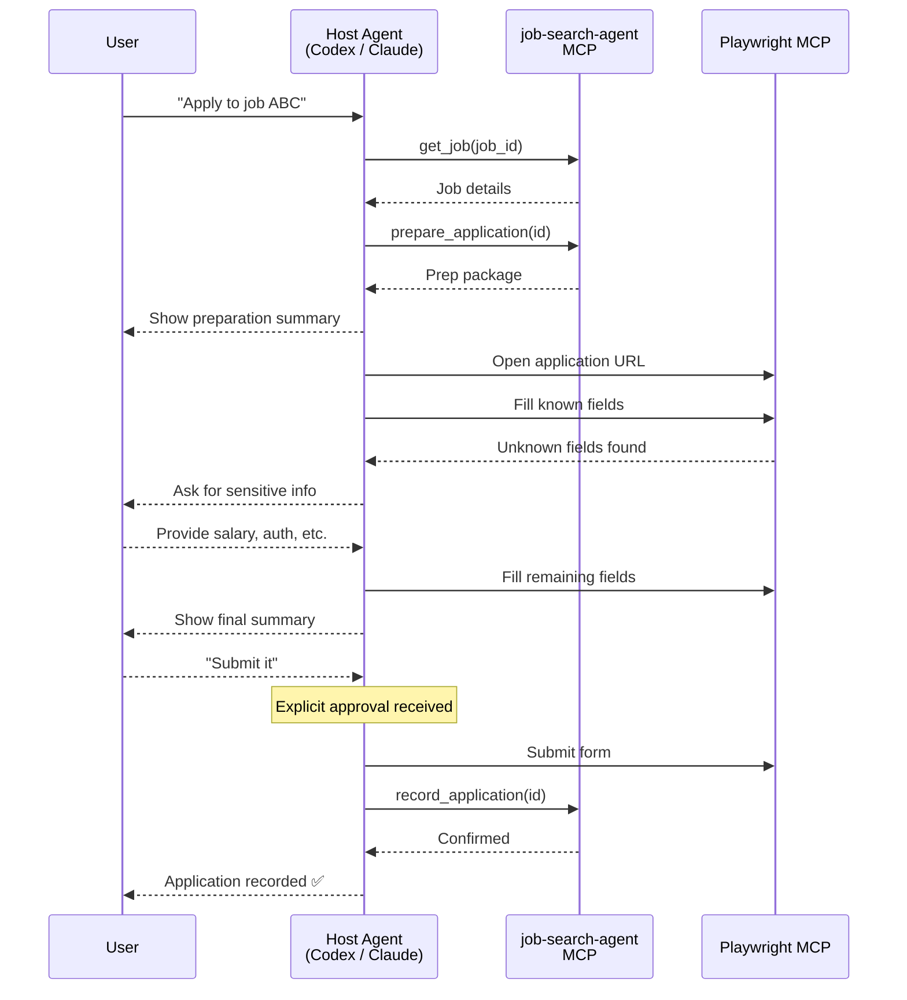

# Playwright MCP Integration

The job-search-agent does NOT embed a browser automation engine.
Instead, it's designed to work alongside a **Playwright MCP** server
for browser-based form filling.

## Architecture



## Setup Playwright MCP

### Claude Code
```bash
claude mcp add playwright -- npx -y @anthropic/playwright-mcp@latest
```

### Codex
```toml
[mcpServers.playwright]
command = "npx"
args = ["-y", "@anthropic/playwright-mcp@latest"]
```

### Antigravity
```json
{
  "mcpServers": {
    "playwright": {
      "command": "npx",
      "args": ["-y", "@anthropic/playwright-mcp@latest"]
    }
  }
}
```

## Workflow Rules

1. **job-search-agent** handles: search, analyze, match, score, prepare, track
2. **Playwright MCP** handles: open URLs, fill forms, click buttons, read page content
3. **NEVER auto-submit** without explicit user approval
4. **Sensitive fields** (salary, work authorization, etc.) must be filled by the user or with explicit consent

## Fields That Require User Input

The `prepare_application` tool returns a `requires_user_input` list.
These fields must NOT be auto-filled:

- Salary expectation
- Work authorization / visa status
- Disability status
- Veteran status
- Gender / race / ethnicity
- Notice period
- Relocation willingness
- Background check consent
- Security clearance

The host agent should prompt the user for these values before filling them in the form.
